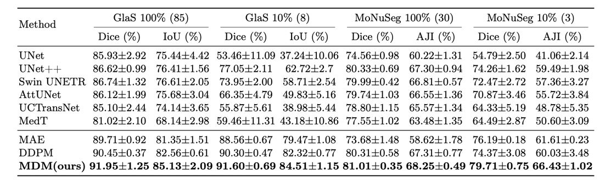
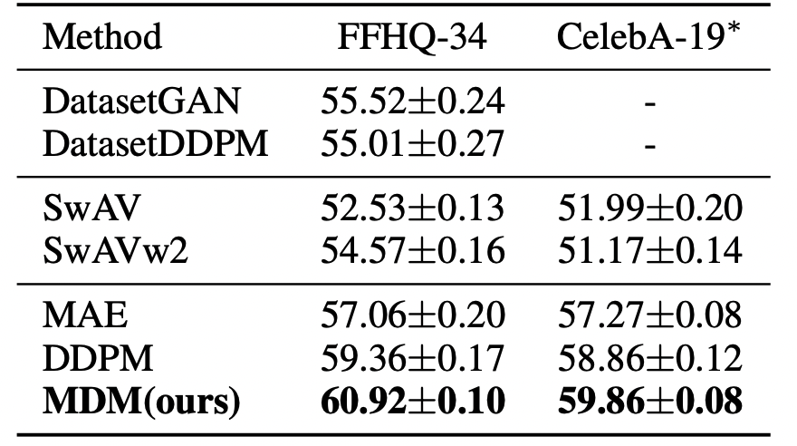

<div align="center">
<h2><a href="https://arxiv.org/pdf/2308.05695.pdf">Masked Diffusion as Self-Supervised Representation Learner</a></h2>

[Zixuan Pan](https://scholar.google.com/citations?user=3VuW2gcAAAAJ&hl=en), [Jianxu Chen](https://scholar.google.com/citations?hl=en&user=HdolpOgAAAAJ), [Yiyu Shi](https://scholar.google.com/citations?hl=en&user=LrjbEkIAAAAJ&view_op=list_works)

[](https://arxiv.org/abs/2308.05695)
[](https://paperswithcode.com/sota/medical-image-segmentation-on-glas?p=masked-diffusion-as-self-supervised)
[](https://paperswithcode.com/sota/medical-image-segmentation-on-monuseg?p=masked-diffusion-as-self-supervised)
</div>

<div align=center></div>

Official PyTorch/GPU implementation of the paper
[Masked Diffusion as Self-Supervised Representation Learner](https://arxiv.org/abs/2308.05695).
This code is based on [ddpm-segmentation](https://github.com/yandex-research/ddpm-segmentation).

## Updates
- [April 12, 2024] The code and checkpoints are released.
- [March 7, 2024] Trained a better MDM on FFHQ.


## Data Preparation
The evaluation is conducted on two medical image segmentation datasets: [GlaS](https://warwick.ac.uk/fac/cross_fac/tia/data/glascontest/) and [MoNuSeg](https://monuseg.grand-challenge.org), and
two natural image segmentation datasets collected by [ddpm-segmentation](https://github.com/yandex-research/ddpm-segmentation): FFHQ-34 and CelebA-19. We use [FFHQ](https://github.com/NVlabs/ffhq-dataset) as the pre-training dataset for FFHQ-34 and CelebA-19 segmentation.


## Installation

Before starting, we recommend to create a new conda environment:
```
conda env create -f environment.yml
```
Then, activate the environment:
```
conda activate masked_diffusion
```

## Pre-training
We provide the pre-training settings in experiments folder in guided_diffusion and mask_diffusion.
For example, to pre-train MDM on MoNuSeg, run:
```
python masked_diffsuion/experiments/MoNuSeg/Train.py
```
The model trained on FFHQ for DDPM is adopted from [ddpm-segmentation](https://github.com/yandex-research/ddpm-segmentation).
We provide the pre-trained models for DDPM and MDM on GlaS and MoNuSeg datasets, and the pre-trained model for MDM on FFHQ.
The pre-trained models are available at [Google Drive](https://drive.google.com/drive/folders/1P5NnGJkMHpkRWdEvBxuhg06xI1hnct5F?usp=share_link).

## Fine-tuning
Before fine-tuning, please download the pre-trained models and put them in the corresponding folders. Then,
revise the json file in ./experiments folder and change the dataset name in script file. Finally, run:
```
bash scripts/mdm_glas_monuseg.sh
```

## Results
Performance in terms of Dice, IoU and AJI evaluated on GlaS, MoNuSeg:
<div align=center></div>
Performance in terms of mean IoU evaluated on FFHQ-34, CelebA-19:
<div align=center></div>


## Cite
If you find this repository useful, please use the following BibTeX entry for citation.
```
@misc{pan2023masked,
      title={Masked Diffusion as Self-supervised Representation Learner}, 
      author={Zixuan Pan and Jianxu Chen and Yiyu Shi},
      year={2023},
      eprint={2308.05695},
      archivePrefix={arXiv},
      primaryClass={cs.CV}
}
```