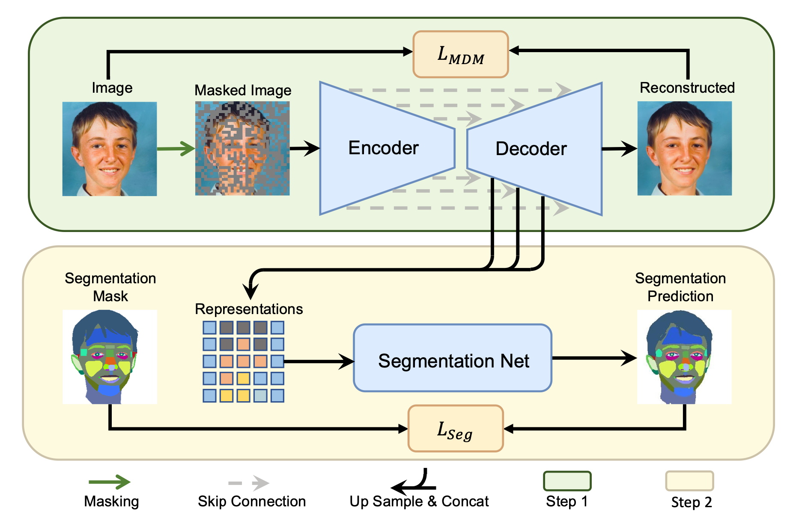

# Masked Diffusion as Self-Supervised Representation Learner

<div align=center></div>

This is a PyTorch/GPU re-implementation of the paper
[Masked Diffusion as Self-Supervised Representation Learner](https://arxiv.org/abs/2308.05695).


```
@misc{pan2023masked,
      title={Masked Diffusion as Self-supervised Representation Learner}, 
      author={Zixuan Pan and Jianxu Chen and Yiyu Shi},
      year={2023},
      eprint={2308.05695},
      archivePrefix={arXiv},
      primaryClass={cs.CV}
}
```

## Installation

Before starting, we recommend to create a new conda environment:
```
conda env create -f environment.yml
```
Then, activate the environment:
```
conda activate masked_diffusion
```

## Pre-training
We provide the pre-training settings in experiments folder in guided_diffusion and mask_diffusion.
For example, to pre-train MDM on MoNuSeg, run:
```
python masked_diffsuion/experiments/MoNuSeg/Train.py
```
The pre-trained models for DDPM and MDM are available at [Google Drive](https://drive.google.com/drive/folders/1P5NnGJkMHpkRWdEvBxuhg06xI1hnct5F?usp=share_link).

## Fine-tuning
Before fine-tuning, please download the pre-trained models and put them in the corresponding folders. Then,
revise the json file in ./experiments folder and run:
```
qsub job/mdm_monuseg.job
```
or change the job file to run on a local machine:
```
bash job/mdm_monuseg.sh
```

**MIT license**